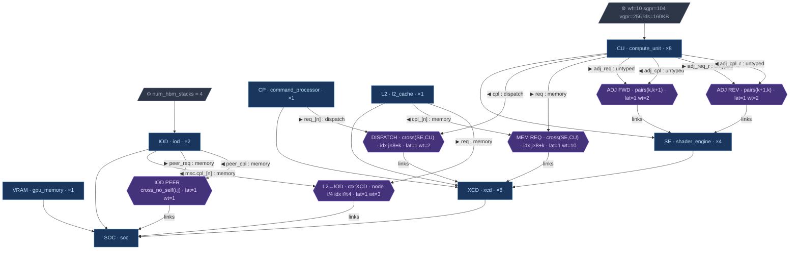

# CDNA4 GPU Topology — Node Graph

Node-graph representation of `configs/amdgpu_cdna4.json`.

## Legend

| Shape | Meaning |
|-------|---------|
| **Blue box** | Hardware node — tree edges point child → parent |
| **Edge label** (◀/▶ name : protocol) | Socket — labels the edge from component to connector |
| **Purple hexagon** | Connector node — a link pattern; `links` edge goes to owning component |
| **Trapezoid** (⚙) | Config options on the hardware node |

### Connector mask builtins

| Mask | Expansion |
|------|-----------|
| `cross(A, B)` | All `(a, b)` pairs — full cross-product of instances of A and B |
| `cross_no_self(A, B)` | Cross-product excluding `a == b` |
| `pairs(k, k+1)` | Adjacent pairs within the same container — `(0,1), (1,2), …` |

A connector's **context** component determines how many times the entire
pattern repeats.  When omitted, the context defaults to the nearest common
ancestor of `from` and `to`.

## Diagram

## Connection summary

| Connector | From | To | Mask | Context | Instances |
|-----------|------|----|------|---------|-----------|
| DISPATCH | `CP.req_[j×8+k]` | `CU.cpl` | `cross(SE, CU)` | XCD (implicit) | 8 XCDs × 4 SEs × 8 CUs = **256** |
| MEM REQUEST | `CU.req` | `L2.cpl_[j×8+k]` | `cross(SE, CU)` | XCD (implicit) | 8 × 4 × 8 = **256** |
| L2 → IOD | `L2.req` | `IOD.msc.cpl_[i%4]` | identity | XCD (explicit) | 8 XCDs = **8** |
| IOD PEER | `IOD.peer_req` | `IOD.peer_cpl` | `cross_no_self(i, j)` | SOC (implicit) | 2 × 1 = **2** |
| ADJ FORWARD | `CU.adj_req` | `CU[k+1].adj_cpl` | `pairs(k, k+1)` | SE (implicit) | 8 × 4 × 7 = **224** |
| ADJ REVERSE | `CU[k+1].adj_req_r` | `CU.adj_cpl_r` | `pairs(k+1, k)` | SE (implicit) | 8 × 4 × 7 = **224** |
